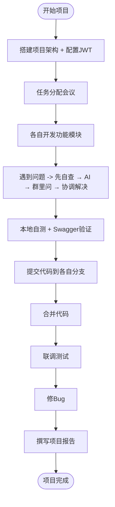
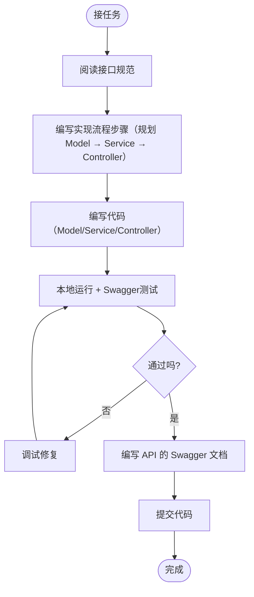
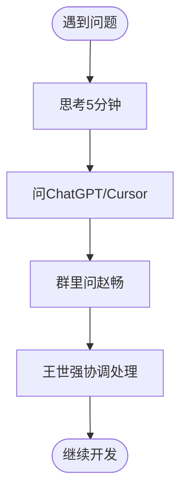
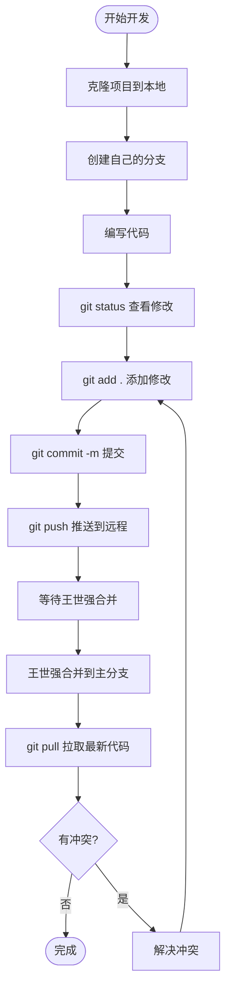

# WEB新闻发布系统 - 开发流程图

## 🏗️ 整体开发流程

---

## 👤 个人开发流程（欧阳/心怡/黄奕）

---

## 🔧 遇到问题解决流程

---

## 🔄 Git协作流程

---

## 📋 团队角色职责

### 王世强（组长）
- 第1天：搭建项目架构
- 第2-3天：协调团队、合并代码

### 赵畅（技术支持）
- 第1天：配置JWT、创建工具类
- 第2-3天：随时在线帮助解决问题
- Code Review

### 欧阳（开发）
- 负责：F6 用户登录注册
- 分支：dev-auth

### 心怡（开发）
- 负责：F1/F2/F3 新闻模块
- 分支：dev-news

### 黄奕（开发）
- 负责：F4/F5/F7 附件模块 + 测试
- 分支：dev-attachment

---

## ⏱️ 时间节点

| 时间 | 节点 |
|------|------|
| 第1天上午 | 王世强搭建完架构 |
| 第1天下午 | 赵畅配置完JWT |
| 第1天晚上 | 开会同步进度 |
| 第2天全天 | 欧阳/心怡/黄奕开发 |
| 第3天全天 | 检查进度（应完成60%+） |
| 第4天上午 | 完成所有开发 |
| 第4天下午 | 联调测试 |
| 第4天晚上 | 修复Bug |
| 第5天全天 | 撰写报告 |

---

**提示：** 本流程图仅供参考，实际开发中可灵活调整

